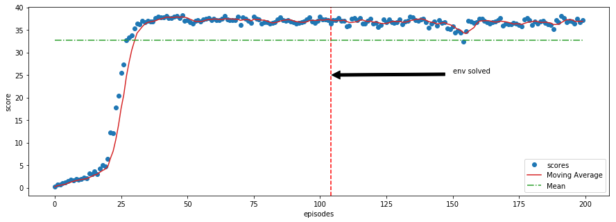

# Reacher

Unity Machine Learning Agents (ML-Agents) is an open-source Unity plugin that enables games and simulations to serve as environments for training intelligent agents.

For game developers, these trained agents can be used for multiple purposes, including controlling NPC behavior (in a variety of settings such as multi-agent and adversarial), automated testing of game builds and evaluating different game design decisions pre-release.

## The Environment

In this environment, a double-jointed arm can move to target locations. A reward of +0.1 is provided for each step that the agent's hand is in the goal location. Thus, the goal of your agent is to maintain its position at the target location for as many time steps as possible.

The observation space consists of 33 variables corresponding to position, rotation, velocity, and angular velocities of the arm. Each action is a vector with four numbers, corresponding to torque applicable to two joints. Every entry in the action vector should be a number between -1 and 1.


The task is episodic, and in order to solve the environment, your agent must get an average score of +30 over 100 consecutive episodes.

## Installation

Use the [docker](https://www.docker.com) to test the algorithm.

```bash
docker pull fernandofsilva/reacher 
```


## Usage

Run the container to start the jupyter notebook server

```bash
docker run -t -p 8888:8888 fernandofsilva/reacher 
```

And you can access the notebook through the link is provided.

To train the agent with different parameters, you just need to access the notebook, change the parameters on the sections
4.1 and 4.2 and check the results on section 4.3.


## Scores

Below, there are the scores during training of the neural network, the environment was solved in the episode 104 (between the episode 4 and 104 the average return were above 30). 




## Contributing

Pull requests are welcome. For major changes, please open an issue first to discuss what you would like to change.


## License

[MIT](https://choosealicense.com/licenses/mit/)